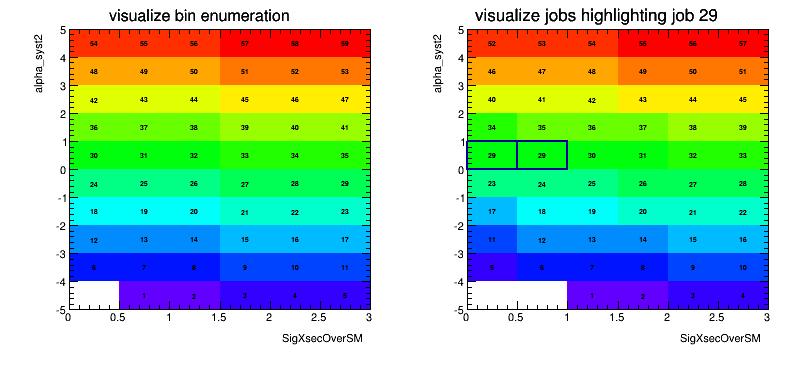
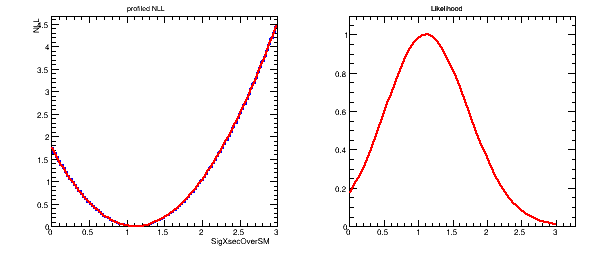

# BatchLikelihoodScan

Creates (profile) likelihood scans of RooFit/RooStats models in any dimension locally or on batch systems.

# Install

Setup your virtualenv

```
virtualenv venv
source venv/bin/activate
```

and install this package

```
pip install git+https://github.com/svenkreiss/BatchLikelihoodScan.git
```


# Example

Scanning grid is constructed from the parameters of interest in the `ModelConfig` and the bins set for these parameters. The algorithm is completely general and works for any (reasonable) number of parameters.

The plot shows the job number for every grid point for a given total number 
of jobs (in this case 16). You can reproduce this with

```
# prepare histfactory workspace area:
#  creates folder structure and an example model
prepareHistFactory
hist2workspace config/example.xml

batchLikelihoodScan --overwritePOI=SigXsecOverSM=1,alpha_syst2=0 --overwriteBins=SigXsecOverSM=6,alpha_syst2=10 -f -j 16 -c 14
```

For book-keeping and later plotting setup, it prints this at the beginning:

```
# Batch Job

* Total grid points: 60
* Total number of jobs: 16
* This job number: 14
* Processing these grid points: [53,57)


# Parameters Of Interest

* POI SigXsecOverSM=[6,0.000000,3.000000]
* POI alpha_syst2=[10,-5.000000,5.000000]
```

Followed by the unconditional fit result:

```
ucmles -- nll=-1044.37839796, SigXsecOverSM=1.1144431068, alpha_syst2=0.000244219915544
```

And then it starts looping of the grid points.




# 1D plots

Produce sample log file:

```
batchLikelihoodScan --overwritePOI=SigXsecOverSM=1 --overwriteBins=SigXsecOverSM=100 -j 1 -c 0 -q | tee batchProfile.log
```

And create plots:

```
batchLikelihoodPlot --subtractMinNLL
```

The argument to "-i" can be a glob expression to log files (add quotes). Use "-q" to 
suppress drawing and saving of the png image.


